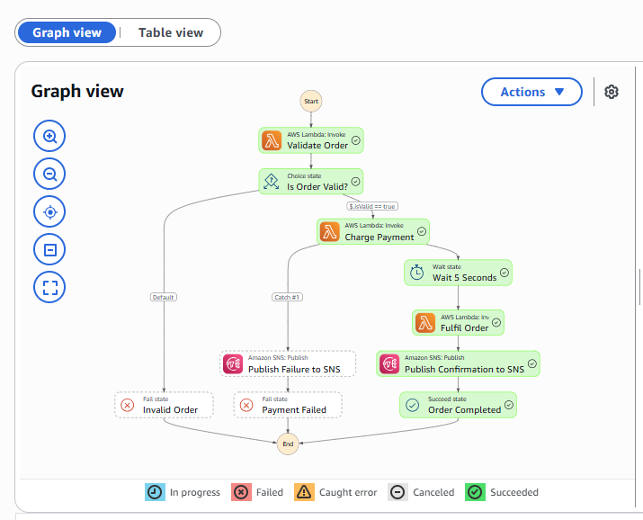
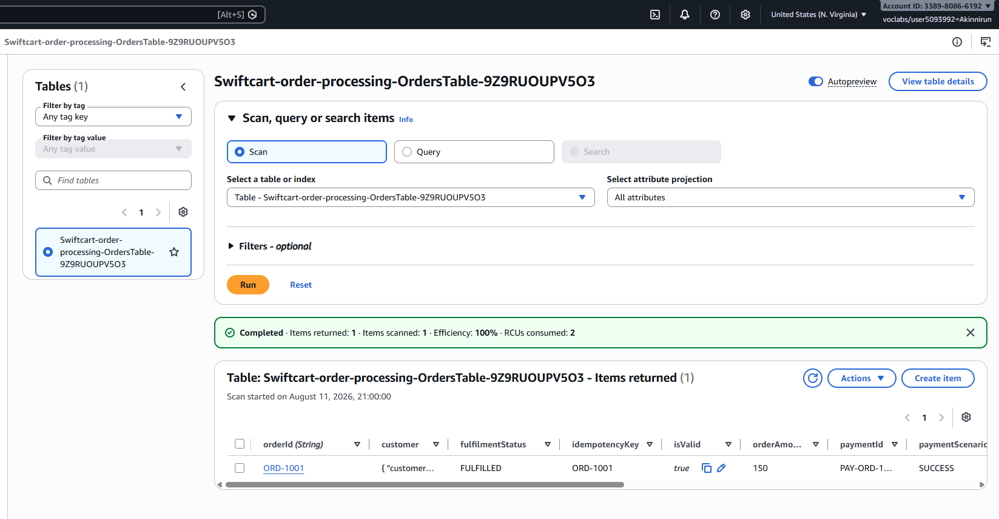
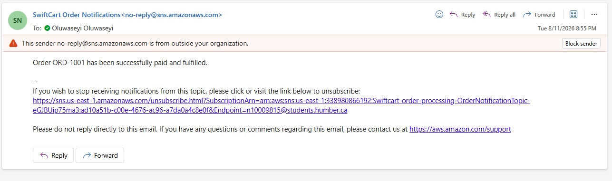

# SwiftCart Order-Processing Workflow

## Business overview

SwiftCart Inc. is a rapidly growing online retailer that sells consumer electronics, home appliances, and lifestyle products across North America. Customers can place orders 24 hours a day through the company's website and mobile application.

As order volume has increased, SwiftCart has experienced delays and failures in processing customer orders. Its existing order-management system relies on manual intervention and tightly coupled services, making it difficult to track an order from validation through payment, fulfilment, and customer notification.

The company also experiences temporary payment-processing failures caused by timeouts, rate limits, and unreliable payment-gateway connections. These failures can leave orders incomplete, require employees to investigate them manually, and potentially create duplicate payment attempts.

To improve reliability, scalability, operational visibility, and customer experience, SwiftCart has decided to modernize its order-processing system using AWS serverless technologies. The proposed solution uses AWS Step Functions to orchestrate the workflow, AWS Lambda to perform order-processing tasks, Amazon DynamoDB to store completed orders, and Amazon SNS to notify customers about successful or failed orders.

Each submitted order must pass through the following processing stages:

1. Validate the order information.
2. Process the customer's payment.
3. Fulfil the order.
4. Store the completed order in the company's database.
5. Notify the customer about the outcome.

## Customer and operational problem

The primary customer is an online shopper who expects their order to be processed quickly, accurately, and securely. The customer should receive clear confirmation when an order succeeds and an appropriate notification when it cannot be completed.

The company's order-management and customer-service teams are also important internal users. They need to know the status of each order and understand where and why a failure occurred.

The existing order-processing approach has several operational problems:

- Orders can contain missing or invalid information.
- Payment providers can experience temporary timeouts, rate limits, or service interruptions.
- An order can become stranded if a system component fails halfway through processing.
- Repeating a payment request without proper controls could charge the customer more than once.
- Technical teams may find it difficult to determine which processing stage failed.
- Customers may not receive timely confirmation when an order succeeds or fails.

Each order depends on several connected stages: validation, payment, fulfilment, storage and customer notification. A failure at any stage can interrupt the entire process. Payment processing is particularly vulnerable to transient failures such as timeouts, rate limits and unreliable gateway connections. These failures must be retried safely without creating duplicate charges or leaving the order in an uncertain processing state.

SwiftCart Inc. therefore requires a workflow that can validate orders, retry temporary failures safely, record completed orders, and provide clear notifications.

## Why Step Functions

Implementing the workflow by having each Lambda function directly invoke the next would create tightly coupled dependencies between the processing stages. As the workflow grows, this approach becomes difficult to visualize, monitor, debug and modify. Each Lambda would also require custom logic to track progress, initiate retries and determine what should happen after a failure. If a function crashed partway through the process, an order could become stranded without a clear indication of its current state or the action required to recover it.

AWS Step Functions solves this problem by keeping the workflow logic in a state machine. The service determines which task runs next, evaluates validation results, applies retry rules, catches exhausted payment errors, and records the execution history.

## Objectives

- Validate every submitted order before attempting payment.
- Reject invalid orders without charging or fulfilling them.
- Retry temporary payment failures using exponential backoff.
- Route exhausted payment failures through a controlled notification path.
- Fulfil and store only successfully paid orders.
- Notify the customer of payment success or failure through Amazon SNS.
- provide traceability through Step Functions and CloudWatch Logs.
- Deploy the solution consistently using one CloudFormation template.

## Architecture

The solution contains the following AWS services:

| Service | Purpose |
| --- | --- |
| AWS Step Functions | Orchestrates the complete order-processing workflow. |
| AWS Lambda | Validates orders, simulates payment processing, and fulfils successful orders. |
| Amazon DynamoDB | Stores completed orders that were successfully paid and fulfilled. |
| Amazon SNS | Publishes success and payment-failure email notifications. |
| Amazon CloudWatch Logs | Stores Lambda and state-machine logs for monitoring and troubleshooting. |
| AWS IAM | Controls the permissions used by Lambda and Step Functions. |
| AWS CloudFormation | Defines and deploys the infrastructure and application code. |


### Orchestration versus choreography

SwiftCart uses orchestration. Step Functions is the central coordinator and explicitly directs each Lambda function and service integration. In a choreography design, each component would react to an event and independently trigger or influence the next component without one central workflow controller. Orchestration was selected because the order process has a defined sequence, decision point, retry policy, failure routes, and audit requirements.

## State-flow diagram

The state-flow diagram presents the logical execution paths implemented by the Step Functions state machine. It shows the valid-order route, the invalid-order decision, the payment Retry and Catch behaviour, direct SNS notifications, the five-second Wait state, and the successful and failed end states.


> **Figure 2:** SwiftCart order-processing state flow, including the happy path, invalid-order path and payment-failure path.

## State-machine workflow

1. **Validate Order** invokes the validation Lambda.
2. **Is Order Valid?** checks whether `$.isValid` equals `true`.
3. Invalid orders follow the default route to **Invalid Order**, a `Fail` state.
4. Valid orders proceed to **Charge Payment**.
5. Temporary payment failures are retried with exponential backoff.
6. Exhausted payment errors are caught and routed to **Publish Failure to SNS**, followed by **Payment Failed**.
7. Successful payments proceed to **Wait 5 Seconds**.
8. **Fulfil Order** sets the final statuses and writes the completed order to DynamoDB.
9. **Publish Confirmation to SNS** sends the success notification.
10. **Order Completed** ends the workflow successfully.

### State types demonstrated

| State | Type | Purpose |
| --- | --- | --- |
| Validate Order | Task | Invokes the validation Lambda. |
| Is Order Valid? | Choice | Routes valid and invalid orders. |
| Invalid Order | Fail | Ends an invalid execution. |
| Charge Payment | Task | Invokes the payment Lambda and contains Retry and Catch rules. |
| Publish Failure to SNS | Task | Uses direct SNS service integration for a failure notification. |
| Payment Failed | Fail | Ends an execution after payment retries are exhausted. |
| Wait 5 Seconds | Wait | Represents a short inventory-reservation or fraud-review period. |
| Fulfil Order | Task | Fulfils and stores the completed order. |
| Publish Confirmation to SNS | Task | Uses direct SNS service integration for a success notification. |
| Order Completed | Succeed | Ends a successful execution. |

## Order input structure

The deployed prototype uses a single `product` object. A valid order contains:

- `orderId`
- Customer ID, name, and email
- Product ID and product name
- Quantity, available inventory, and unit price
- Order amount
- Payment scenario (`SUCCESS` or `FAIL`)

Example:

```json
{
  "orderId": "ORD-1001",
  "customer": {
    "customerId": "CUST-101",
    "name": "Seyi Akinnirun",
    "email": "n10009815@students.humber.ca"
  },
  "product": {
    "productId": "PROD-501",
    "productName": "Wireless Headphones",
    "quantity": 2,
    "availableInventory": 10,
    "unitPrice": 75
  },
  "orderAmount": 150,
  "paymentScenario": "SUCCESS"
}
```

## Validation rules

The Validate Order Lambda checks that:

- The order ID exists.
- Customer ID, name, and email exist.
- Product ID and product name exist.
- Quantity is greater than zero.
- Available inventory is zero or greater.
- Requested quantity does not exceed available inventory.
- Unit price is greater than zero.
- Order amount is greater than zero.
- Order amount equals quantity multiplied by unit price.
- Payment scenario is either `SUCCESS` or `FAIL`.

It returns `isValid`, `validationErrors`, and `validationMessage` while preserving the order data for subsequent states.

## Reliability and error handling

### Payment Retry

The Charge Payment state retries selected temporary and AWS service errors:

```yaml
IntervalSeconds: 2
BackoffRate: 2.0
MaxAttempts: 2
```

In Amazon States Language, `MaxAttempts` counts the number of **retries**, not the original invocation. Therefore, `MaxAttempts: 2` permits a maximum of **three total payment attempts**: one original attempt plus two retries. With a backoff rate of `2.0`, the first retry occurs after approximately two seconds and the second after approximately four seconds.

### Payment Catch

If payment continues to fail after the permitted retries, `Catch` captures `States.ALL`, saves error information at `$.paymentError`, and routes the execution to **Publish Failure to SNS**. The workflow then enters the **Payment Failed** Fail state.

### Stretch state: Wait state and justification

The selected stretch state is a five-second AWS Step Functions `Wait` state placed after successful payment and before the Fulfil Order Lambda. It represents a short holding period during which SwiftCart could complete an inventory reservation, fraud-risk review or another asynchronous pre-fulfilment check before committing the order for fulfilment.

The state is placed after payment because only successfully paid orders should enter this holding period. It is placed before fulfilment to prevent the order from being stored as completed until the simulated review or reservation period has finished. Invalid orders and payments that fail after all retries never reach the Wait state.

A Step Functions Wait state was selected instead of adding a delay inside a Lambda function. Holding a Lambda invocation open solely to wait would waste compute time, increase cost and mix timing logic with business-processing code. The Wait state expresses the delay directly in the workflow, remains visible in the execution graph and does not require a running Lambda function during the delay.

Five seconds was selected for the prototype because it is long enough to be observable during a live demonstration while keeping repeated testing fast. In production, a preceding service could determine the appropriate delay based on the order's risk level, inventory-reservation window or another business rule. The Wait state could then read that value dynamically using `SecondsPath` or wait until a specified timestamp using `TimestampPath`.

The successful-order test demonstrated that the workflow entered and completed the Wait state before invoking Fulfil Order. The invalid-order and payment-failure executions did not enter it, confirming that only successfully validated and paid orders reached the pre-fulfilment delay.

## Payment idempotency

The prototype derives the payment idempotency key from `orderId` and reuses the same key during every Step Functions retry. CloudWatch Logs demonstrated that all three payment attempts for `ORD-1003` used `ORD-1003` as the idempotency key.

Because payment is simulated, the prototype does not make a real financial charge or persist payment results. In production, the Charge Payment Lambda would atomically store the payment status against this key in DynamoDB and also submit the same key to the payment provider. Repeated requests would then return the original stored/provider result instead of creating a duplicate charge.

## Security and IAM

The production design in the CloudFormation template contains dedicated least-privilege role definitions:

- Basic Lambda permission to write application logs.
- Fulfilment Lambda permission to write logs and the specific DynamoDB table.
- Step Functions permission to invoke the three Lambda functions, publish to the specific SNS topic, and deliver workflow logs.

The AWS Academy Learner Lab blocks `iam:CreateRole`. Therefore, the deployed lab configuration sets `UseExistingLabRole` to `true` and reuses the pre-provisioned `LabRole`, whose trust policy permits both `lambda.amazonaws.com` and `states.amazonaws.com`. In an unrestricted AWS account, `UseExistingLabRole` can be set to `false` to create the dedicated roles.

## Deployment

### Prerequisites

- Access to an AWS account or AWS Academy Learner Lab.
- Permission to create CloudFormation, Lambda, Step Functions, DynamoDB, SNS, and CloudWatch resources.
- A valid email address for the SNS subscription.
- The deployment region set to `us-east-1` for the demonstrated lab.

### CloudFormation deployment steps

1. Open AWS CloudFormation and select **Create stack**.
2. Choose **With new resources (standard)**.
3. Upload `SwiftCart_CloudFormation_Template.yaml`.
4. Enter a stack name, such as `Swiftcart-order-processing`.
5. Enter the notification email address.
6. In AWS Academy, leave `UseExistingLabRole` set to `true`.
7. Leave stack-level tags and the optional CloudFormation service role blank in the Learner Lab.
8. Review the configuration and create the stack.
9. Wait for `CREATE_COMPLETE`.
10. Review the Resources and Outputs tabs.
11. Open the SNS confirmation email and confirm the subscription.

### Important outputs

The template returns:

- Charge Payment Lambda function name
- Fulfil Order Lambda function name
- Notification topic ARN
- Orders table name
- State machine ARN
- State machine name
- Validate Order Lambda function name

## Test results

### Test 1: Happy path

**Execution name:** `successful-order-test`  
**Order ID:** `ORD-1001`  
**Payment scenario:** `SUCCESS`

Expected and observed result:

- Validation succeeded.
- Choice selected the valid route.
- Payment succeeded.
- Wait state executed.
- Fulfilment succeeded.
- DynamoDB stored the completed order.
- SNS published a success notification.
- The execution ended at **Order Completed** with `Succeeded` status.

The DynamoDB record showed `isValid: true`, `paymentStatus: PAID`, `fulfilmentStatus: FULFILLED`, `orderAmount: 150`, and the completed processing information.

**Evidence:**
**Successful Step Functions execution**


**Completed order stored in DynamoDB**


**SNS success notification**


### Test 2: Invalid-order path

**Execution name:** `invalid-order-test`  
**Order ID:** `ORD-1002`  
**Invalid condition:** Requested quantity `20` exceeded available inventory `5`.

**Execution input:**

```json
{
  "orderId": "ORD-1002",
  "customer": {
    "customerId": "CUST-102",
    "name": "Test Customer",
    "email": "test@example.com"
  },
  "product": {
    "productId": "PROD-502",
    "productName": "Laptop",
    "quantity": 20,
    "availableInventory": 5,
    "unitPrice": 100
  },
  "orderAmount": 2000,
  "paymentScenario": "SUCCESS"
}
```

The order amount is internally consistent because `20 × 100 = 2000`. The order was deliberately made invalid only by setting the requested quantity to `20` while available inventory was `5`. The Validate Order Lambda added `isValid: false` and a validation error indicating that the requested quantity exceeded available inventory. The Choice state therefore followed its default route to **Invalid Order**.

Expected and observed result:

- Validation returned `isValid: false`.
- Choice selected its default invalid route.
- The execution reached **Invalid Order** and intentionally displayed `Failed`.
- Payment, fulfilment, SNS, and DynamoDB storage did not execute.
- `ORD-1002` was not stored as a completed order.

Evidence:

- `06-invalid-order-path.png`

### Test 3: Payment-failure path

**Execution name:** `payment-failure-test`  
**Order ID:** `ORD-1003`  
**Payment scenario:** `FAIL`

**Execution input:**

```json
{
  "orderId": "ORD-1003",
  "customer": {
    "customerId": "CUST-103",
    "name": "Payment Test Customer",
    "email": "test@example.com"
  },
  "product": {
    "productId": "PROD-503",
    "productName": "Smart Watch",
    "quantity": 2,
    "availableInventory": 10,
    "unitPrice": 125
  },
  "orderAmount": 250,
  "paymentScenario": "FAIL"
}
```

This input passed validation because all required fields and values were valid. The payment failure was deliberately triggered by `paymentScenario: "FAIL"`. The Charge Payment Lambda reads that value and raises the named temporary error used by the state machine's Retry rule:

```python
scenario = str(order.get("paymentScenario", "SUCCESS")).upper()

if scenario == "FAIL":
    raise PaymentTransientError(
        f"Simulated temporary payment failure for order {order_id}"
    )
```

Step Functions invoked the same payment task three times in total. After the original attempt and two retries failed, the Catch rule routed the execution to **Publish Failure to SNS** and then **Payment Failed**.

Expected and observed result:

- Validation succeeded.
- Charge Payment raised `PaymentTransientError`.
- The maximum of three total attempts—the original attempt and two retries—all failed.
- Retry delays were approximately two and four seconds.
- Catch routed the execution to **Publish Failure to SNS**.
- SNS published the failure notification.
- The execution reached **Payment Failed** and intentionally displayed `Failed`.
- Fulfilment and DynamoDB storage did not execute.

Evidence:

- `07-payment-retries.png`
- `08-payment-catch-path.png`
- `09-sns-payment-failure.png`
- `10-payment-idempotency-log.png`

## Evidence checklist

- `01-stack-create-complete.png`
- `02-state-machine-graph.png`
- `03-happy-path.png`
- `04-dynamodb-order.png`
- `05-sns-success.png`
- `06-invalid-order-path.png`
- `07-payment-retries.png`
- `08-payment-catch-path.png`
- `09-sns-payment-failure.png`
- `10-payment-idempotency-log.png`

## Lessons learned

- A state machine makes multi-step serverless processing easier to observe and control than direct Lambda-to-Lambda calls.
- Choice states keep invalid data away from payment and fulfilment services.
- Retry and exponential backoff handle temporary failures without custom retry loops.
- Catch provides a deliberate recovery route after retries are exhausted.
- Idempotency requires a stable key and, in production, persistent/provider-side enforcement.
- CloudFormation provides consistent deployment but must account for restrictions imposed by training environments.
- CloudWatch and Step Functions execution history provide complementary operational evidence.

## Cleanup

At the end of the demonstration:

1. Open AWS CloudFormation.
2. Select the SwiftCart stack.
3. Choose **Delete** and confirm.
4. Wait until the stack disappears from active stacks or deletion completes.
5. Check whether any log groups or subscriptions remain and remove them if required by the lab instructions.

Do not delete the stack until all screenshots, test evidence, and the recorded demonstration have been completed.
